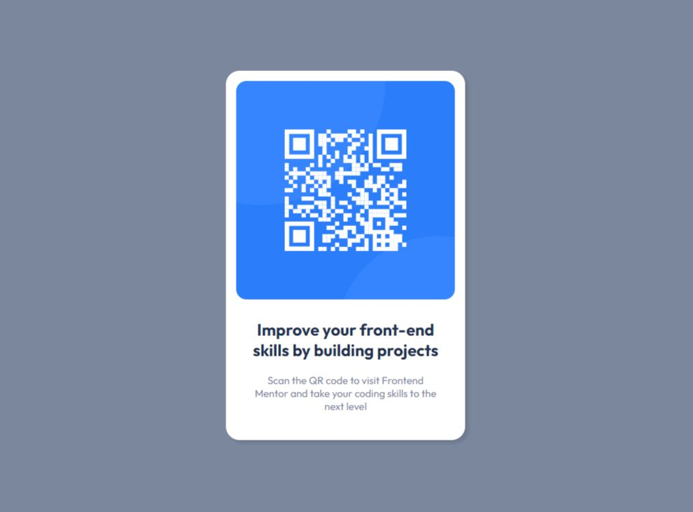

# Frontend Mentor - QR code component solution

This is a solution to the [QR code component challenge on Frontend Mentor](https://www.frontendmentor.io/challenges/qr-code-component-iux_sIO_H). Frontend Mentor challenges help you improve your coding skills by building realistic projects. 

## Table of contents

- [Overview](#overview)
  - [Screenshot](#screenshot)
  - [Links](#links)
- [My process](#my-process)
  - [Built with](#built-with)
  - [What I learned](#what-i-learned)
  - [Continued development](#continued-development)
  - [Useful resources](#useful-resources)
- [Author](#author)

**Note: Delete this note and update the table of contents based on what sections you keep.**

## Overview

### Screenshot

### Links

- Solution URL: [https://github.com/karan819381/Qr-code-components-with-React]
- Live Site URL: [Add live site URL here]

## My process

### Built with

- Semantic HTML5 markup
- CSS custom properties
- Flexbox
- CSS Grid
- Mobile-first workflow
- [React](https://react.dev/)
- [TailWind](https://tailwindcss.com/) - For styles

### What I learned

- i learned React and tailwind and how to use this. it's my first project in react using tailwind.

### Continued development

Learning React

### Useful resources

- [TailwindCss](https://tailwindcss.com/) - Documentation of tailwindcss

## Author

- Frontend Mentor - [@karan819381](https://www.frontendmentor.io/profile/karan819381)

